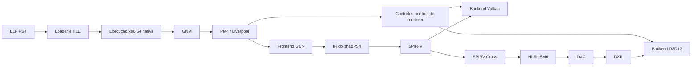

# Arquitetura

## Objetivo

Executar o shadPS4 no Xbox Series S em Dev Mode com UWP x64 e Direct3D 12,
preservando o frontend AMD Liverpool/PM4 e o IR de shaders do upstream.

## Limites de plataforma

O baseline público é UWP/AppContainer. GDK/GameCore é um alvo separado,
condicionado a autorização da Microsoft e nunca deve introduzir SDKs ou material
sob NDA no repositório.

## Fluxo pretendido



## Princípios

1. Validar memória e execução antes do renderer.
2. Manter o backend Vulkan funcional durante o desacoplamento.
3. Abstrair semântica do guest, não criar uma cópia da API Vulkan.
4. Consultar capabilities D3D12 em runtime.
5. Tratar falhas de alocação como fluxo normal e mensurável.
6. Nunca depender de um limite observado somente com debugger conectado.

## Gates de viabilidade

Os probes são implementados em `src/phase0` sem dependência de console ou UI.
Dois hosts consomem a mesma biblioteca: o runner Win32 usado pelo CI e o host
UWP x64 instalado no Xbox. Isso evita comparar implementações diferentes ao
investigar divergências entre desktop e console.

### Gate A: memória virtual

- reserva e commit de grandes intervalos;
- endereços solicitados/fixos;
- proteções `NOACCESS`, `RW` e `RX`;
- mappings aliases/placeholder;
- tratamento de access violations.

### Gate B: código executável

O pacote UWP deve declarar `codeGeneration`. O probe deve comprovar transição
RW para RX, flush do instruction cache e chamada indireta de um trampoline x64.
Páginas simultaneamente graváveis e executáveis não fazem parte do desenho.

### Gate C: gráficos

- device e swapchain D3D12;
- shader compilado em runtime;
- root signature e PSO;
- apresentação sem debugger;
- DRED e coleta de logs em falha.

O host do Gate C cria dispositivo, command queue, swapchain de `CoreWindow`,
fence, root signature e graphics PSO. Um shader de probe usa `SV_VertexID` para
desenhar um triângulo sem vertex buffer. Ele é compilado em runtime pelo DXC
como Shader Model 6/DXIL. `dxcompiler.dll` e o validador `dxil.dll` da versão do
Windows SDK usada no build são empacotados junto ao MSIX, evitando dependência
implícita de uma instalação de ferramentas no console.

O probe usa as interfaces estáveis `IDxcLibrary` e `IDxcCompiler`. O primeiro
teste com `IDxcCompiler3` retornou `E_NOINTERFACE` no Series S, embora a mesma
versão compilasse no SDK 26100. A escolha da interface antiga afeta somente a
API de invocação do compilador; a saída continua sendo Shader Model 6/DXIL.

## Fronteira futura do renderer

Os contratos neutros deverão cobrir:

- device, queues, command contexts e fences;
- buffers, imagens, views e samplers;
- descriptors e constantes;
- barriers e hazards;
- draw, dispatch, copy, clear e resolve;
- pipelines e cache persistente;
- queries e apresentação.

Tipos `vk::*` ou `ID3D12*` não poderão atravessar essa fronteira.

## Fronteira do host

`Frontend::Window` é o contrato entre o ciclo de execução do emulador e a
janela fornecida pela plataforma. `Core::Emulator` recebe uma
`Frontend::WindowFactory`; ele não escolhe SDL, UWP ou outro toolkit.

No desktop, `main.cpp` injeta `WindowSDL`. O host UWP deverá injetar uma
implementação baseada em `CoreWindow`, com seu próprio loop de eventos e
superfície D3D12. A interface Vulkan também consome o contrato neutro e obtém o
handle nativo por `WindowSystemInfo`.

O handle opaco retornado por `GetFrontendHandle()` é uma ponte transitória para
os adaptadores SDL de ImGui e mouse. Código novo de core ou renderer não deve
depender desse handle.

## Biblioteca USB no host UWP

O host não converte permissão WinRT em acesso irrestrito por caminho. A pasta
selecionada é mantida como uma cadeia relativa ao dispositivo removível e
resolvida novamente por objetos `StorageFolder` a cada ativação.

```text
KnownFolders.RemovableDevices
  -> caminho relativo persistido
  -> enumeração StorageFolder limitada
  -> eboot.bin + sce_sys/param.sfo
  -> parser PSF limitado da bridge do core
  -> modelo textual do shell D3D12
```

O parser recebe bytes lidos por `FileIO`, usa os layouts PSF do upstream e não
confia em offsets, contagens ou terminação NUL vindos do arquivo. Essa fronteira
mantém as APIs WinRT no host e os detalhes do formato Orbis na bridge do core.
