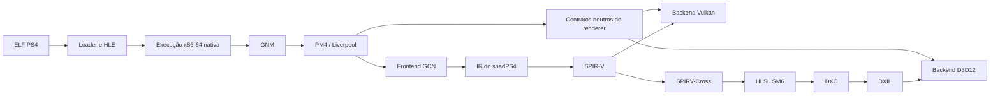

# Arquitetura

## Objetivo

Executar o shadPS4 no Xbox Series S em Dev Mode com UWP x64 e Direct3D 12,
preservando o frontend AMD Liverpool/PM4 e o IR de shaders do upstream.

## Limites de plataforma

O baseline público é UWP/AppContainer. GDK/GameCore é um alvo separado,
condicionado a autorização da Microsoft e nunca deve introduzir SDKs ou material
sob NDA no repositório.

## Fluxo pretendido

## Princípios

1. Validar memória e execução antes do renderer.
2. Manter o backend Vulkan funcional durante o desacoplamento.
3. Abstrair semântica do guest, não criar uma cópia da API Vulkan.
4. Consultar capabilities D3D12 em runtime.
5. Tratar falhas de alocação como fluxo normal e mensurável.
6. Nunca depender de um limite observado somente com debugger conectado.

## Gates de viabilidade

Os probes são implementados em `src/phase0` sem dependência de console ou UI.
Dois hosts consomem a mesma biblioteca: o runner Win32 usado pelo CI e o host
UWP x64 instalado no Xbox. Isso evita comparar implementações diferentes ao
investigar divergências entre desktop e console.

### Gate A: memória virtual

- reserva e commit de grandes intervalos;
- endereços solicitados/fixos;
- proteções `NOACCESS`, `RW` e `RX`;
- mappings aliases/placeholder;
- tratamento de access violations.

### Gate B: código executável

O pacote UWP deve declarar `codeGeneration`. O probe deve comprovar transição
RW para RX, flush do instruction cache e chamada indireta de um trampoline x64.
Páginas simultaneamente graváveis e executáveis não fazem parte do desenho.

### Gate C: gráficos

- device e swapchain D3D12;
- shader compilado em runtime;
- root signature e PSO;
- apresentação sem debugger;
- DRED e coleta de logs em falha.

O primeiro degrau do Gate C já cria um dispositivo, uma command queue e uma
swapchain de `CoreWindow`, faz um clear verde/vermelho e apresenta. Ele ainda
não contém PSO, shaders ou sincronização de múltiplos frames; esses itens
pertencem ao probe seguinte.

## Fronteira futura do renderer

Os contratos neutros deverão cobrir:

- device, queues, command contexts e fences;
- buffers, imagens, views e samplers;
- descriptors e constantes;
- barriers e hazards;
- draw, dispatch, copy, clear e resolve;
- pipelines e cache persistente;
- queries e apresentação.

Tipos `vk::*` ou `ID3D12*` não poderão atravessar essa fronteira.
