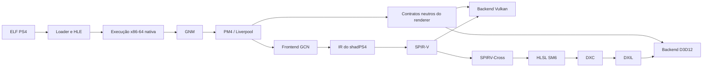
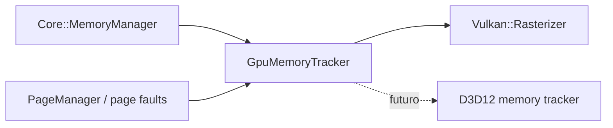

# Arquitetura

## Objetivo

Executar o shadPS4 no Xbox Series S em Dev Mode com UWP x64 e Direct3D 12,
preservando o frontend AMD Liverpool/PM4 e o IR de shaders do upstream.

## Limites de plataforma

O baseline público é UWP/AppContainer. GDK/GameCore é um alvo separado,
condicionado a autorização da Microsoft e nunca deve introduzir SDKs ou material
sob NDA no repositório.

## Fluxo pretendido


```mermaid
flowchart LR
    ELF[ELF PS4] --> Loader[Loader e HLE]
    Loader --> CPU[Execução x86-64 nativa]
    CPU --> GNM[GNM]
    GNM --> PM4[PM4 / Liverpool]
    PM4 --> RHI[Contratos neutros do renderer]
    RHI --> VK[Backend Vulkan]
    RHI --> D3D[Backend D3D12]
    PM4 --> FE[Frontend GCN]
    FE --> IR[IR do shadPS4]
    IR --> SPV[SPIR-V]
    SPV --> VK
    SPV --> CROSS[SPIRV-Cross]
    CROSS --> HLSL[HLSL SM6]
    HLSL --> DXC[DXC]
    DXC --> DXIL[DXIL]
    DXIL --> D3D
```

## Princípios

1. Validar memória e execução antes do renderer.
2. Manter o backend Vulkan funcional durante o desacoplamento.
3. Abstrair semântica do guest, não criar uma cópia da API Vulkan.
4. Consultar capabilities D3D12 em runtime.
5. Tratar falhas de alocação como fluxo normal e mensurável.
6. Nunca depender de um limite observado somente com debugger conectado.

## Gates de viabilidade

Os probes são implementados em `src/phase0` sem dependência de console ou UI.
Dois hosts consomem a mesma biblioteca: o runner Win32 usado pelo CI e o host
UWP x64 instalado no Xbox. Isso evita comparar implementações diferentes ao
investigar divergências entre desktop e console.

### Gate A: memória virtual

- reserva e commit de grandes intervalos;
- endereços solicitados/fixos;
- proteções `NOACCESS`, `RW` e `RX`;
- mappings aliases/placeholder;
- tratamento de access violations.

### Gate B: código executável

O pacote UWP deve declarar `codeGeneration`. O probe deve comprovar transição
RW para RX, flush do instruction cache e chamada indireta de um trampoline x64.
Páginas simultaneamente graváveis e executáveis não fazem parte do desenho.

### Gate C: gráficos

- device e swapchain D3D12;
- shader compilado em runtime;
- root signature e PSO;
- apresentação sem debugger;
- DRED e coleta de logs em falha.

O host do Gate C cria dispositivo, command queue, swapchain de `CoreWindow`,
fence, root signature e graphics PSO. Um shader de probe usa `SV_VertexID` para
desenhar um triângulo sem vertex buffer. Ele é compilado em runtime pelo DXC
como Shader Model 6/DXIL. `dxcompiler.dll` e o validador `dxil.dll` da versão do
Windows SDK usada no build são empacotados junto ao MSIX, evitando dependência
implícita de uma instalação de ferramentas no console.

Na Fase 3A, `platform/xbox_uwp/d3d12_device_context.*` possui o device, a fila
direta, o fence e o evento de espera. Ele cria pares de allocator/list para o
shell e para upload de ícones. `D3D12StatusRenderer` continua responsável por
swapchain, RTV/SRV e recursos da interface. Na 3B, o contexto submete listas e
devolve tickets monotônicos de fence. Cada um dos dois backbuffers possui um
allocator/list e o ticket de seu último uso; o shell espera esse ticket antes
de resetar o allocator. A apresentação não faz mais uma espera completa ao
final de cada frame. A troca do SRV compartilhado de ícone, a suspensão e o
encerramento drenam a fila; o upload de ícones permanece síncrono. Contadores
de frames, listas, reutilizações e esperas são persistidos com os probes.
O contexto não é ligado ao `GpuCommandSink` nem traduz comandos PM4.

O probe usa as interfaces estáveis `IDxcLibrary` e `IDxcCompiler`. O primeiro
teste com `IDxcCompiler3` retornou `E_NOINTERFACE` no Series S, embora a mesma
versão compilasse no SDK 26100. A escolha da interface antiga afeta somente a
API de invocação do compilador; a saída continua sendo Shader Model 6/DXIL.

## Fronteira futura do renderer

Os contratos neutros deverão cobrir:

- device, queues, command contexts e fences;
- buffers, imagens, views e samplers;
- descriptors e constantes;
- barriers e hazards;
- draw, dispatch, copy, clear e resolve;
- pipelines e cache persistente;
- queries e apresentação.

Tipos `vk::*` ou `ID3D12*` não poderão atravessar essa fronteira.

### Primeiro corte: coerência de memória

`VideoCore::GpuMemoryTracker` é o primeiro contrato implementado dessa
fronteira. `Core::MemoryManager` e `PageManager` publicam eventos usando somente
endereços virtuais e tamanhos do guest. O backend Vulkan implementa o contrato
em `Vulkan::Rasterizer`; o futuro backend D3D12 implementará a mesma semântica
com seus próprios caches.


```mermaid
flowchart LR
    MM[Core::MemoryManager] --> GMT[GpuMemoryTracker]
    PM[PageManager / page faults] --> GMT
    GMT --> VKR[Vulkan::Rasterizer]
    GMT -. futuro .-> D12R[D3D12 memory tracker]
```

A interface não recebe recursos nativos e não cobre draw, dispatch ou
apresentação. Esses limites serão extraídos separadamente para evitar uma
abstração prematura que apenas replique Vulkan.

### Segundo corte: comandos PM4

`AmdGpu::Liverpool` decodifica os pacotes PM4 e envia operações ao
`VideoCore::GpuCommandSink`. A interface transporta valores do guest para draw,
dispatch, DMA/GDS, sincronização e marcadores; `Vulkan::Rasterizer` permanece
como implementação ativa. `Liverpool` não inclui tipos do renderer Vulkan.

Este corte não define ainda buffers/imagens nativos, descriptors, pipelines ou
swapchain. A configuração `IsVkHostMarkersEnabled` continua controlando os
marcadores de diagnóstico existentes até a migração das preferências do
renderer.

### Terceiro corte: estado de acesso a buffers

`VideoCore::BufferSyncState` armazena a última intenção de acesso ao buffer
(vértices, índices, indireto, shader, transferência ou uso geral) e emite uma
transição com estado anterior, próximo estado e faixa afetada. A lógica não
conhece `vk::*` nem `ID3D12*`.

O `VideoCore::Buffer` existente continua sendo um recurso Vulkan. Ele traduz
as transições para estágios e máscaras de acesso Vulkan ao construir
`vk::BufferMemoryBarrier2`. A transição inicial mantém a máscara ampla usada
antes da extração. O rastreador não resolve hazards de imagem, ownership de
queues ou residency; esses casos exigem contratos próprios.

### Quarto corte: descrição de buffers

`VideoCore::BufferDesc` descreve o recurso antes de sua criação: endereço do
guest, tamanho, preferência de memória e usos necessários. `BufferUsage` usa
flags sem dependência de Vulkan; inclui transferência, uniform/storage,
vértices, índices, indireto e endereço de dispositivo. Um endereço zero indica
buffer utilitário sem mapeamento direto para a memória do guest.

Na implementação atual, `VideoCore::Buffer` traduz esses usos para
`vk::BufferUsageFlags` e continua alocando via VMA. O futuro backend D3D12
deverá traduzir o mesmo descritor para seus recursos e estados, levando em
conta que algumas capacidades do Vulkan não correspondem a flags de criação
do D3D12.

### Quinto corte: descrição de image views

`VideoCore::ImageViewDesc` concentra os campos da view que vêm do guest:
dimensionalidade, subrecursos, swizzle de componentes, LOD mínimo, intenção de
escrita e formato original. `ImageViewInfo` acrescenta o formato Vulkan usado
hoje para a criação e comparação das views em cache. A conversão de
`AmdGpu::CompMapping` para `vk::ComponentMapping` ocorre na criação da view.

O mapeamento de formatos e a compatibilidade entre formatos ainda dependem do
Vulkan. A futura fronteira de formatos precisará representar essas regras sem
alterar a interpretação dos recursos do guest.

### Sexto corte: identidade do formato de imagem

`VideoCore::ImageFormatDesc` preserva o formato informado pelo guest como um
dos três casos: surface (data/number format e intenção de depth), depth/stencil
ou VideoOut. O descritor não contém formatos Vulkan nem D3D12. Para imagens
auxiliares sem formato identificado, usa-se o estado vazio.

`ImageInfo` mantém `guest_format` e o campo `pixel_format` legado. O segundo é
resolvido a partir do primeiro pela conversão Liverpool→Vulkan existente.
`IsCompatible`, criação/alocação e interpretação de formatos continuam
específicas do Vulkan. O descritor evita perder a identidade original
em conversões não injetivas (por exemplo, dois formatos VideoOut que resultam
no mesmo `vk::Format`), mas não promete uma equivalência direta com `DXGI_FORMAT`.

### Sétimo corte: formato das image views

`ImageViewDesc` também carrega `guest_format`; a view preserva o formato original
mesmo quando Vulkan exige um ajuste na representação nativa. Por exemplo, uma
view storage com formato sRGB do guest é convertida para UNORM apenas ao chamar
`LiverpoolToVK::ImageFormat`. A mesma função resolve o formato de `ImageInfo` e
das views, evitando regras duplicadas no cache de texturas.

`ImageViewInfo::operator==` mantém a chave de cache Vulkan anterior: geometria,
swizzle, intenção storage e formato Vulkan. Dois descritores do guest que
produzam a mesma view nativa podem reutilizá-la. Um cache D3D12 deverá definir
sua própria chave conforme as regras de compatibilidade e formatos DXGI.

### Oitavo corte: capacidades de uso das imagens

`VideoCore::ImageUsage` descreve as capacidades que o cache solicita para uma
imagem: cópia de/para, sampling, attachment color/depth-stencil e storage.
`CachedImageUsage` preserva a política existente: imagens coloridas recebem
storage para evitar recriação posterior, e imagens comprimidas mantêm essa
capacidade para permitir views não comprimidas. A função é independente de API
e coberta por teste unitário.

Na criação Vulkan, `ToVulkanUsage` traduz essas capacidades para
`vk::ImageUsageFlags`. A extensão de attachment feedback loop só é acrescentada
quando suportada pelo dispositivo. Recursos, views, layout e barriers permanecem
no backend Vulkan; `ImageUsage` não é uma enumeração de estados D3D12.

### Nono corte: transições de imagens

`VideoCore::ImageSyncState` rastreia um estado sem tipos Vulkan para cada
backing image. O estado contém layout semântico, classe de acesso e estágio de
execução. Uma transição total pode gerar uma única descrição; uma transição
parcial mantém estados por mip/layer e gera descrições para os subrecursos que
precisam de barrier. A lista curta usa armazenamento inline para evitar uma
alocação no caminho comum.

O adaptador em `Image::GetBarriers` converte layouts/acessos/estágios recebidos
dos chamadores Vulkan para o rastreador, depois produz os
`vk::ImageMemoryBarrier2`. `Image::CurrentLayout()` fornece o layout nativo
necessário a operações Vulkan existentes. A política de hazard foi preservada:
escritas de transferência, shader e memória forçam barrier mesmo quando o
estado seguinte é idêntico; alterar apenas o estágio não força barrier.

Isso não define ainda uma API neutra para os comandos de transição vindos do
rasterizer, nem traduz essas transições para D3D12. Essas interfaces pertencem
ao próximo corte de fronteira dos caches.

## Fronteira do host

`Frontend::Window` é o contrato entre o ciclo de execução do emulador e a
janela fornecida pela plataforma. `Core::Emulator` recebe uma
`Frontend::WindowFactory`; ele não escolhe SDL, UWP ou outro toolkit.

No desktop, `main.cpp` injeta `WindowSDL`. O host UWP deverá injetar uma
implementação baseada em `CoreWindow`, com seu próprio loop de eventos e
superfície D3D12. A interface Vulkan também consome o contrato neutro e obtém o
handle nativo por `WindowSystemInfo`.

O handle opaco retornado por `GetFrontendHandle()` é uma ponte transitória para
os adaptadores SDL de ImGui e mouse. Código novo de core ou renderer não deve
depender desse handle.

## Biblioteca USB no host UWP

O host não converte permissão WinRT em acesso irrestrito por caminho. A pasta
selecionada é mantida como uma cadeia relativa ao dispositivo removível e
resolvida novamente por objetos `StorageFolder` a cada ativação.

```text
KnownFolders.RemovableDevices
  -> caminho relativo persistido
  -> enumeração StorageFolder limitada
  -> eboot.bin + sce_sys/param.sfo
  -> parser PSF limitado da bridge do core
  -> sce_sys/icon0.png opcional
  -> Windows.Graphics.Imaging (BGRA8, máximo 256x256)
  -> upload sob demanda da seleção para SRV D3D12
  -> modelo visual do shell D3D12
```

O parser recebe bytes lidos por `FileIO`, usa os layouts PSF do upstream e não
confia em offsets, contagens ou terminação NUL vindos do arquivo. Essa fronteira
mantém as APIs WinRT no host e os detalhes do formato Orbis na bridge do core.

O PNG nunca é interpretado pelo parser PSF. O host limita o arquivo codificado
a 8 MiB, rejeita dimensões de origem acima de 4096 e pede ao decoder WinRT uma
saída BGRA8 de no máximo 256×256. Os pixels permanecem em memória de CPU no
modelo da biblioteca; o renderer mantém apenas uma textura GPU, correspondente
ao jogo selecionado. A troca aguarda a fence existente antes de substituir o
SRV. Ausência, PNG inválido ou falha de upload não remove o jogo da lista.
